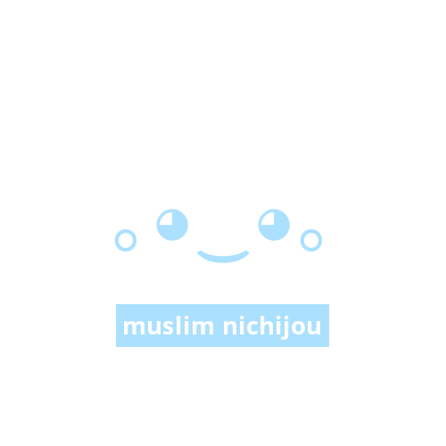

 

Muslim Nichijou is made on the basis of a sense of concern for fellow humans in search of true truth. Our foundation is the Word of Allah (Qur'an) and the tradition related to the words and deeds of Prophet Muhammad (peace and blessings be upon him), the ahadith.   
真のイスラームに関する情報を日本のコミュニティに提供する。

